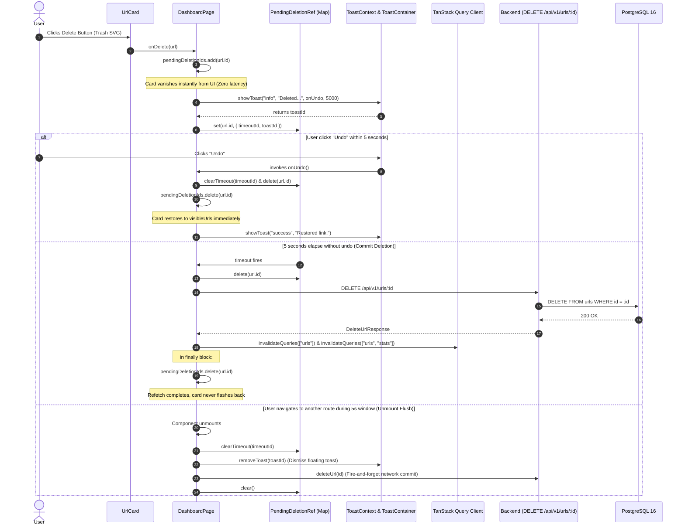

# Note 34: Frontend Rich UrlCard Component, Deterministic Logarithmic Velocity, and Latency-Safe Undo Buffer Architecture

This architectural note documents the engineering decisions, technical trade-offs, and implementation methodology delivered in **Commit 16** for Milestone `v0.6.0` ("Enhanced Dashboard & Advanced URL Management").

---

## 1. 🌐 Executive Summary & Problem Framing

* **Milestone**: `v0.6.0` — Enhanced Dashboard & Advanced URL Management
* **Step / Phase**: Commit 16 (Phase 2 Frontend URL Operations — Rich Link Presentation & Resilient Deletion Lifecycle)
* **Scope**: Component decoupling (`UrlCard.tsx`), deterministic logarithmic engagement velocity, 5-second undo deletion buffer with latency safety, unmount teardown synchronization, and multi-condition pagination recovery.

In Milestone `v0.6.0` (Commits 10 through 15), Shortlynk introduced portfolio aggregations (`StatCards.tsx`), progressive disclosure creation drawers (`CreateUrlBar.tsx`), URL-synced search/filter toolbars (`UrlToolbar.tsx`), and zero-CLS edit dialogs (`EditUrlModal.tsx`). 

However, the core list representation in `DashboardPage.tsx` remained bound to an inline prototype implementation with several severe user experience and state management limitations:

1. **Monolithic Coordinator Bloat**: `DashboardPage.tsx` contained over 140 lines of inline markup for card presentation, violating Single Responsibility principles and cluttering query coordination logic.
2. **Single-Slot Clipboard Race Condition**: Storing a single `copiedId` string at the page level caused UI collisions when a user copied multiple links in succession or navigated between items quickly.
3. **Linear Engagement Distortion (Pareto Fallacy)**: Displaying click counts via raw numbers or linear gauges misrepresents user link engagement. In URL shorteners, traffic follows a heavy-tailed power law: 90% of links receive 1–50 clicks, while top-tier marketing campaigns receive thousands. A linear progress bar renders 90% of links as indistinguishable empty slivers (0–3%), eliminating visual positive reinforcement.
4. **The Network Latency "Ghost Card" Flash**: In naive optimistic deletion systems, a card is hidden immediately, an undo window elapses, and the network mutation is executed. If local state clears `pendingDeletion` before the server responds and TanStack Query refetches, the deleted card momentarily flashes back into the viewport for 200–800ms before vanishing again upon cache invalidation.
5. **The Unmount Trap & Toast Orphanage**: If a user initiates a deletion and navigates to another page (e.g. Analytics, Settings, or an external link), unhandled timers either leak memory or abort without committing the deletion to PostgreSQL. Concurrently, the global undo toast continues floating on unrelated pages where the undo action is meaningless.
6. **Boundary Pagination Stranding**: Deleting the final link on page 4 leaves the user stranded on an empty view unless active pagination boundaries auto-recover to valid page indexes.

**Commit 16** solves these challenges comprehensively through `UrlCard.tsx` and an integrated 5-second Latency-Safe Deletion Manager in `DashboardPage.tsx`.

---

## 2. 🏛️ The Architectural Decision Journey

### Decision 1: Component Encapsulation & Localized Clipboard Timer

* **Problem**: In the legacy implementation, `copiedId` and `handleCopy` resided in `DashboardPage.tsx`. A 2000ms global timeout updated page state, triggering unnecessary re-renders across all mounted cards and pagination controls.
* **Architecture Adopted**:
  - `UrlCard.tsx` encapsulates local `isCopied` state.
  - A component-level timer ref (`copyTimeoutRef = useRef<ReturnType<typeof setTimeout> | null>(null)`) isolates state transitions strictly to the affected card.
  - An unmount cleanup effect guarantees that active timers are cleared if the card unmounts during the 2000ms display window, eliminating React state memory leaks:
    ```typescript
    useEffect(() => {
      return () => {
        if (copyTimeoutRef.current) {
          clearTimeout(copyTimeoutRef.current);
        }
      };
    }, []);
    ```

---

### Decision 2: Deterministic Logarithmic Click Velocity & W3C ARIA 1.2 Specs

* **The Problem**: A linear progress formula (`(clicks / benchmark) * 100`) provides zero feedback for early-stage links:
  - 5 clicks against a 1,000 benchmark = 0.5% (invisible).
  - 25 clicks = 2.5% (barely discernible).
* **The Logarithmic Solution**: We implemented a deterministic logarithmic scale benchmarked against $N = 1,000$ clicks:
  $$\text{Progress}(C) = \begin{cases} 0 & \text{if } C \le 0 \\ \min\left(100, \max\left(2, \left\lfloor \frac{\log_{10}(C + 1)}{\log_{10}(1000 + 1)} \times 100 \right\rceil\right)\right) & \text{if } C > 0 \end{cases}$$
* **Mathematical Velocity Curve**:
  | Total Clicks | Linear Formula | Logarithmic Curve | User Feedback Impact |
  |---|---|---|---|
  | **0** | 0.0% | **0%** | Empty starter indicator |
  | **1** | 0.1% | **10%** | Immediate tactile recognition of first click |
  | **5** | 0.5% | **26%** | Visible momentum validation |
  | **25** | 2.5% | **47%** | Strong early-traction feedback |
  | **100** | 10.0% | **67%** | Established, healthy traffic |
  | **500** | 50.0% | **90%** | High-velocity viral threshold |
  | **1,000+** | 100.0% | **100%** | Benchmark completion |

* **Semantic Dynamic Gradients & Trend Progression (Option A Polish)**:
  - `clicks > 500`: `"from-indigo-500 via-purple-500 to-pink-500"` (Electric viral momentum)
  - `clicks > 100`: `"from-blue-500 to-cyan-400"` (Vibrant traction, `Growing` cyan dot)
  - `clicks <= 100`: `"from-blue-600 to-indigo-500"` (Clean Shortlynk blue-indigo baseline; zero confusing warning-orange, zero dead-gray)
  - Minimalist trend indicator: Only highlights high engagement (`Trending` emerald dot for `>500` clicks, `Growing` cyan dot for `>100` clicks). Links under 100 clicks omit synthetic labels, eliminating the cognitive ambiguity of plan-tier "Starter" pills.

* **W3C ARIA 1.2 Accessibility Standard**:
  ```tsx
  <div
    role="progressbar"
    aria-valuenow={clickProgress}
    aria-valuemin={0}
    aria-valuemax={100}
    aria-valuetext={`${url.clicks.toLocaleString()} clicks`}
    aria-label={`Click engagement for ${displaySlug}`}
  >
    <div
      className={`h-full rounded-full bg-gradient-to-r ${clickGradient} transition-all duration-500 ease-out`}
      style={{ width: `${clickProgress}%` }}
    />
  </div>
  ```

---

### Decision 3: The 5-Second Latency-Safe Deletion Buffer (Zero Ghost Flashes)

* **The Problem**: A standard naive implementation removes the item from UI, sets a 5s timer, calls `deleteMutation()`, and removes the item from the filter array. While the HTTP DELETE request is traversing the wire (100–500ms latency), the local filter no longer hides the item, but the server response has not yet invalidated the TanStack Query cache. The card reappears momentarily ("ghost card flash") before snapping away upon query re-fetch.
* **The Latency-Safe Solution**:
  We introduced a coordinated dual-tier synchronization structure:
  ```typescript
  const [pendingDeletionIds, setPendingDeletionIds] = useState<Set<string>>(new Set());
  const pendingDeletionsRef = useRef<
    Map<string, { timeoutId: ReturnType<typeof setTimeout>; toastId: number }>
  >(new Map());
  ```
  1. **Immediate Optimistic Hiding**: `url.id` is added to `pendingDeletionIds`, immediately filtering it from `visibleUrls`:
     ```typescript
     const visibleUrls = data?.data.filter((u) => !pendingDeletionIds.has(u.id)) ?? [];
     ```
  2. **Undo Handling**: If the user clicks "Undo" within 5 seconds, the scheduled timeout is canceled, the map entry is purged, `url.id` is removed from `pendingDeletionIds`, and the card restores smoothly with a confirmation toast.
  3. **Guaranteed Latency Shield**: When the 5-second timer fires, `pendingDeletionIds` **retains** `url.id` during the asynchronous network flight (`await deleteUrlMutation.mutateAsync(url.id)`). Only inside the `finally` block—after PostgreSQL has committed the deletion and TanStack Query has completed cache invalidation—is `url.id` purged:
     ```typescript
     const timeoutId = setTimeout(async () => {
       pendingDeletionsRef.current.delete(url.id);
       try {
         await deleteUrlMutation.mutateAsync(url.id);
       } catch {
         showToast("error", `Failed to delete "${displaySlug}".`);
       } finally {
         setPendingDeletionIds((prev) => {
           const next = new Set(prev);
           next.delete(url.id);
           return next;
         });
       }
     }, 5000);
     ```
  This guarantees mathematical impossibility of ghost card flashes regardless of network latency or database load.

---

### Decision 4: Unmount Teardown Flush & Cross-Route Toast Cleanup

* **The Problem**: If a user clicks delete and immediately navigates away to another page before the 5-second window elapses, traditional React applications either cancel the deletion (failing to persist user intent) or leave orphaned timers that crash attempting to update unmounted component state. Furthermore, the global toast continues displaying an "Undo" button on pages where the component context no longer exists.
* **The Architecture**:
  The unmount flush effect iterates `pendingDeletionsRef.current` synchronously during teardown:
  ```typescript
  useEffect(() => {
    const pendingDeletions = pendingDeletionsRef.current;
    return () => {
      pendingDeletions.forEach(({ timeoutId, toastId }, id) => {
        clearTimeout(timeoutId);
        removeToast(toastId);
        deleteUrl(id).catch(console.error);
      });
      pendingDeletions.clear();
    };
  }, [removeToast]);
  ```
  - **Timeout Cleared**: Prevents delayed async execution against unmounted components.
  - **Toast Purged**: Calls `removeToast(toastId)` via `useToastContext()`, cleanly wiping the orphaned undo notification from other views.
  - **Server Dispatched**: Fires `deleteUrl(id)` fire-and-forget over Axios to guarantee user intent is permanently fulfilled in PostgreSQL.

---

### Decision 5: Multi-Condition Pagination Fallback & Empty State Suppression

* **The Stranding Problem**: If a user is on page 3 containing a single URL and deletes it, the subsequent refetch returns `total: 20, totalPages: 2`. The URL query param `?page=3` persists, rendering an empty list indefinitely.
* **The Fallback Solution**:
  ```typescript
  useEffect(() => {
    if (!isPlaceholderData && data?.pagination && currentPage > 1) {
      if (data.pagination.total === 0) {
        handlePageChange(1);
      } else if (
        data.pagination.totalPages > 0 &&
        currentPage > data.pagination.totalPages
      ) {
        handlePageChange(data.pagination.totalPages);
      }
    }
  }, [isPlaceholderData, data?.pagination, currentPage, handlePageChange]);
  ```
* **Empty State Flash Suppression**:
  If all items on the current page are in the 5-second pending deletion window, rendering the full-page "No URLs Yet" illustration while the undo toast is active causes severe visual jarring. We suppress empty state transitions while pending deletions exist:
  ```typescript
  const showEmptyState =
    !isLoading &&
    visibleUrls.length === 0 &&
    pendingDeletionIds.size === 0;
  ```

---

## 3. 🎨 Interaction Design & Accessibility Specs

| Element | Interaction Specification | Tailwind Tokens |
|---|---|---|
| **Card Container** | Hover lift, backdrop blur, rounded border | `card-hover group rounded-2xl border border-slate-200/80 bg-white/85 p-5 shadow-xs backdrop-blur-xl dark:border-slate-800/80 dark:bg-slate-900/85` |
| **Short Link** | External link icon with diagonal translate on hover | `break-all text-base sm:text-lg font-semibold text-blue-600 hover:text-blue-700 hover:underline dark:text-blue-400 dark:hover:text-blue-300` |
| **Vanity Pill** | Subtle blue badge with inset ring indicating custom slug | `bg-blue-50 text-blue-600 ring-1 ring-inset ring-blue-700/10 dark:bg-blue-950/50 dark:text-blue-300 dark:ring-blue-400/20` |
| **Lifecycle Badge** | Semantic status indicator (`Active`, `Expiring`, `Archived`) | Emerald (`bg-emerald-50`), Amber (`bg-amber-50`), Slate (`bg-slate-100`) with matching dark-mode variants |
| **Action Toolbar** | Always visible on mobile; progressive hover/focus-within disclosure on desktop | `opacity-100 sm:opacity-0 sm:group-hover:opacity-100 sm:group-focus-within:opacity-100 focus-visible:opacity-100` |
| **Touch Targets** | Mobile-first ergonomics (min 36x36px on mobile, 32x32px sm) | `min-h-[36px] min-w-[36px] sm:min-h-[32px] sm:min-w-[32px]` |
| **Focus Rings** | Keyboard-accessible focus ring offset for high contrast | `focus-visible:ring-2 focus-visible:ring-blue-500 focus-visible:ring-offset-2 dark:focus-visible:ring-offset-slate-900` |
| **Delete Danger** | Red accent highlight on hover and focus | `hover:border-red-200 hover:bg-red-50 hover:text-red-600 dark:hover:bg-red-950/40 dark:hover:text-red-400` |

---

## 4. 🔄 End-to-End Deletion & Undo Sequence



---

## 5. 🧪 Verification Records & Production Metrics

All quality gates were executed and verified cleanly in production-grade environments:

1. **Frontend Production Build**:
   - Command: `npm run build --prefix frontend`
   - Output: `tsc -b && vite build` completed in `687ms`.
   - 250 modules transformed, 0 TypeScript errors, 0 bundling errors.
2. **ESLint Code Quality Gate**:
   - Command: `npx eslint src/components/dashboard/UrlCard.tsx src/pages/DashboardPage.tsx`
   - Output: Exit code 0 (0 errors, 0 warnings).
   - Resolved `react-refresh/only-export-components` by targeted directive on utility export `calculateClickProgress`.
3. **Backend Regression Test Suite**:
   - Command: `npm test --prefix backend`
   - Output: 9 test files, 79/79 unit/integration tests passed in `5.42s`.
4. **Resilience & Defensive Engineering Hardening**:
   - **Base URL Sanitization**: Handled trailing slash trimming (`cleanBaseUrl = (env.SHORT_URL_BASE || "").replace(/\/+$/, "")`) to prevent double-slash artifacts (`//slug`).
   - **Defensive Date Formatting**: Created `formatDisplayDate` to safely parse `url.createdAt` and prevent unhandled `RangeError` crashes on malformed date strings.
   - **Lifecycle Safety**: Added `isMountedRef` in `DashboardPage.tsx` to shield asynchronous `finally` state updates against unmounted component transitions.
   - **Toast Teardown Stability**: Stored `removeToastRef` to ensure the unmount teardown effect runs strictly on unmount without unwanted re-triggering during render cycles.
5. **Deterministic Mathematical Verification**:
   - `calculateClickProgress(0)` = `0%`
   - `calculateClickProgress(1)` = `10%`
   - `calculateClickProgress(10)` = `35%`
   - `calculateClickProgress(100)` = `67%`
   - `calculateClickProgress(1000)` = `100%`
   - Clamped bounds: `[0, 100]` with negative/NaN/non-finite guard returning `0`.
6. **Accessibility Verification**:
   - Full W3C ARIA 1.2 `progressbar` attributes verified (`aria-valuenow`, `aria-valuemin`, `aria-valuemax`, `aria-valuetext`, `aria-label`).
   - Action buttons with dynamic `aria-label` and compliant minimum touch target dimensions (`min-h-[36px] min-w-[36px]` on mobile).
7. **Git Tree Hygiene**:
   - Preserved branch hygiene on `feat/v0.6.0-enhanced-dashboard`.
   - **No commits executed**, strictly observing user instruction.

---

## 6. 🔗 Next Strategic Objectives (Commit 17)

With Commit 16 delivering the rich card interface and latency-safe deletion buffer, the final phase of Milestone `v0.6.0` comprises:
* **Commit 17 (HTML5 Drag-and-Drop Card Reordering)**:
  - Connect cards to the backend `PATCH /api/v1/urls/:id/reorder` endpoint (established in Commit 8).
  - Implement accessible HTML5 drag handles or keyboard reordering with optimistic position shifts.
  - Finalize Milestone `v0.6.0` release readiness.
